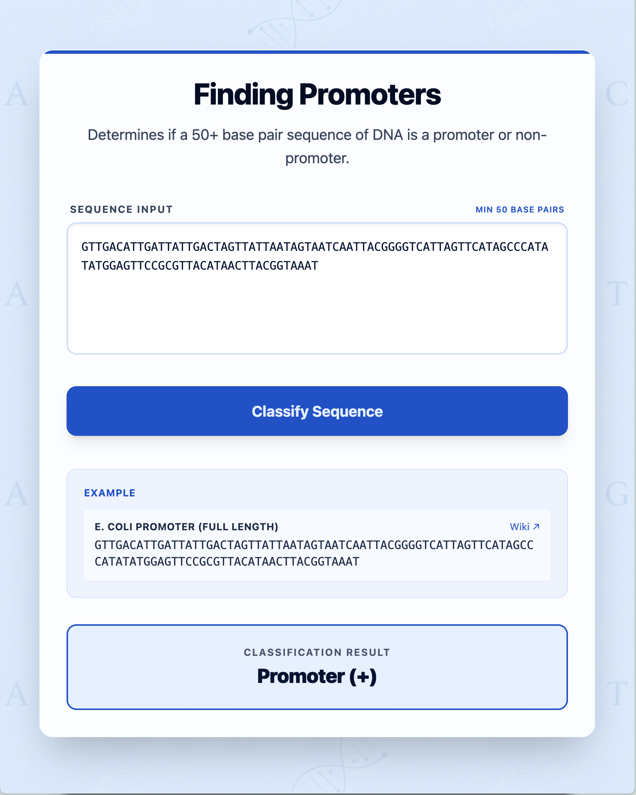

# DNA Promoter Sequence Classifier
A website to predict whether a DNA sequence is a promoter or not.

<div align="center">
  
</div>

## Description
A full-stack DNA Promoter Sequence Classifier web app. The frontend communicates with a Python FastAPI backend to classify DNA sequences as promoters or non-promoters. The model, programmed with the scikit-learn library, was trained on the UCI Machine Learning Repository's Molecular Biology Promoter Gene Sequences dataset using the Random Forest algorithm. The model uses 6-mer features to reach a 95% classification accuracy on test sets.

## Tech Stack
- Frontend: React, Vite, TailwindCSS
- Backend: Python, FastAPI, scikit-learn

## Running on Browser

Website: https://dna-seq-classifier-ryr2.vercel.app/

## Running Locally for Development (without docker)

**1. Start the Backend (FastAPI)**
```bash
cd backend
pip install -r requirements.txt
uvicorn main:app --reload
```
*The backend will be running at `http://localhost:8000`.*

**2. Start the Frontend (React)**
```bash
cd frontend
npm install
npm run dev
```
*The frontend will be running at `http://localhost:5173`.*

## Running on Docker

```bash
# Ensure in the root directory of the project
docker-compose up --build
```
Access the application in your browser at `http://localhost:5173`.

## Limitations
- **Out-of-Distribution Overfitting** The model was trained with a limited amount of dataset, so even if the DNA sequence was over 50 base pairs, it is prone to giving false positives. The Random Forest Classifier does not detect if the features of the input DNA sequence falls far outside of the features of the training dataset.
- **Input Length Limitation**: In order to predict appropriate results, the DNA sequence needs to be at least 50 base pairs long because of the way that the 6-mer features are calculated. This is not practical for some real world applications, and future work can aim to solve this. 
